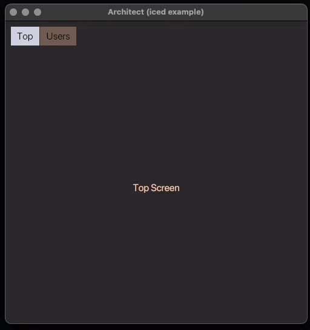

# Architect (Iced Example)

This project demonstrates a simple example of an application using the `iced`
crate to build a UI with two screens: a "Top" screen and a "Users" screen.

It also includes basic navigation between the screens and simulates asynchronous
loading of user data only when the users tab is first selected.

## Features

- **Screen Navigation**: Switch between two screens: "Top" and "Users".
- **Asynchronous Task**: Simulates loading user data asynchronously using `tokio`.
- **Theming**: Custom styling for active/inactive tabs (Top/Users).

## Project Structure

- `App`: The main application struct that manages the current screen and loaded users.
- `Screen`: Enum to represent the active screen (`Top`, `Users`).
- `Users`: Enum representing the state of users (`Loading` or `Loaded` with a `Vec<User>`).

## Running the App

1. Clone the repository.
2. Run `cargo run` to build and launch the application.

